# Informe RF-001
## Integrantes:
- Villegas Suarez, Elmer Jose Manuel
- Figueroa Winkelried, Diego Alonso
- De la Puente Rizo Patron Rodrigo

## Requerimiento

Para este trabajo nos pidieron implementar el **RF-001**: "El sistema debe permitir contar la cantidad de elementos por categoria, el mismo que debe imprimir en la barra de tareas".

Por ejemplo, en el screen se puede notar que existen 2 Package, 2 Class y 1 Component, y el contador deberia mostrarlos en la barra inferior:

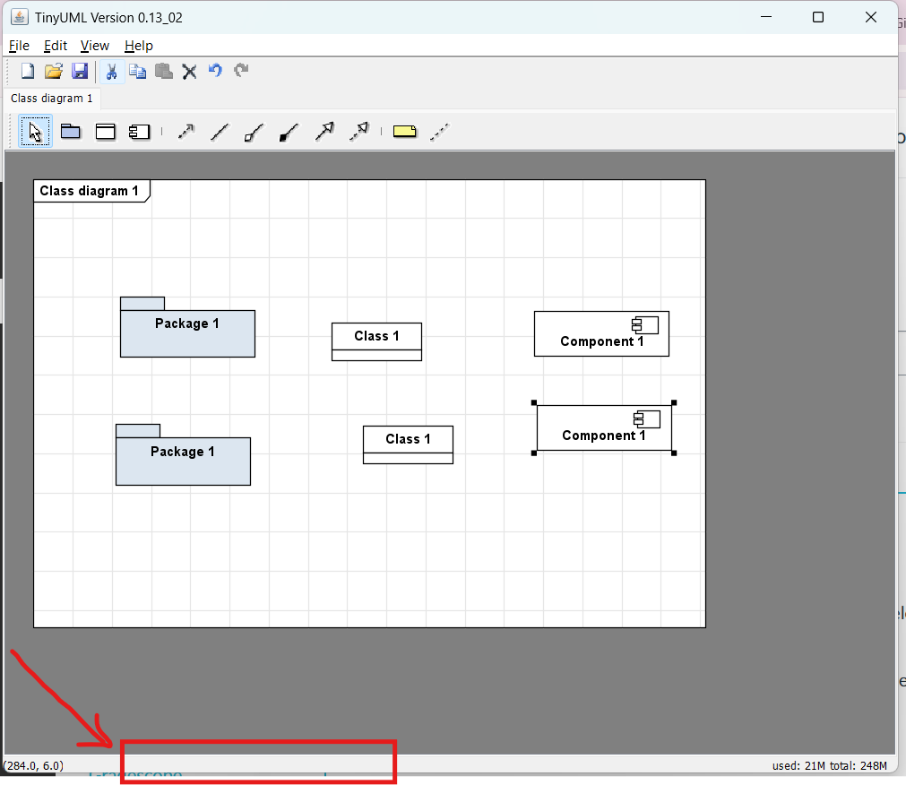

## Archivos modificados

Para que esto funcione tuvimos que tocar tres archivos. Acá se explica que se hizo en cada uno y por que.

### 1. AppFrame.java

Acá es donde se implemento el contador. Agregamos dos metodos nuevos:

- `updateElementCount()`: arma el texto de la barra de tareas con el total y el detalle por categoria (Package, Class, Component, Note). Si una categoria tiene cero elementos no la imprime para que no quede ruido en la barra.
- `countElements(CompositeNode parent, int[] counts)`: recorre de forma recursiva los nodos del diagrama, contando por tipo. Ignora las Connection (asociaciones, dependencias, herencia, conexiones de notas) porque solo nos interesan los elementos visuales como nodos. Es recursivo para que los elementos dentro de un Package tambien se cuenten.

Tambien metimos el `countLabel` en el centro del statusbar para que el contador sea visible.

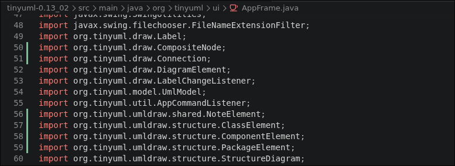
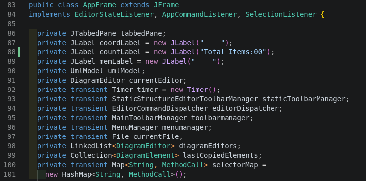
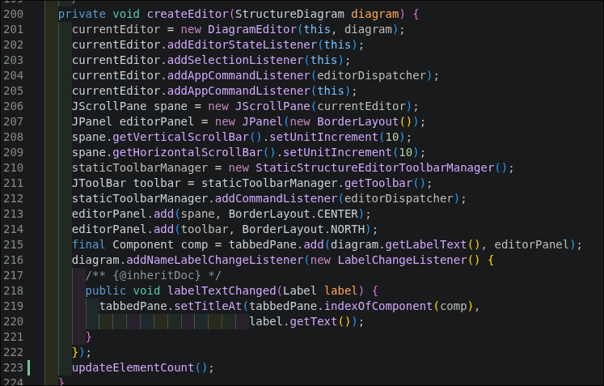
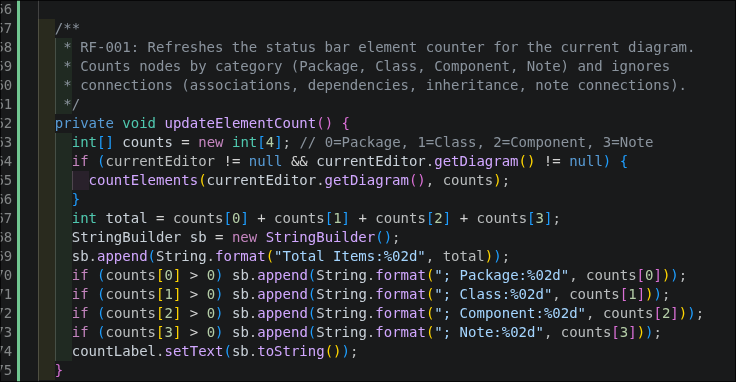
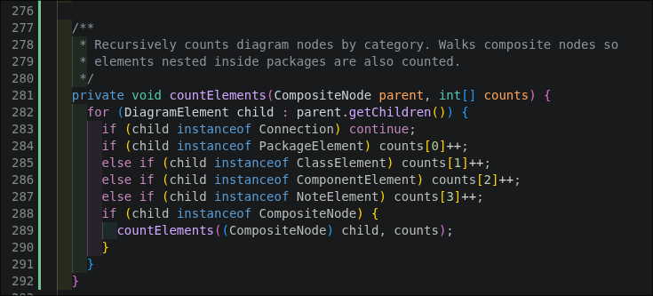
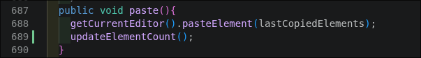

### 2. CompositeNode.java

Cuando intentamos compilar fallaba en "cannot find symbol: method getChildren()". El metodo getChildren() si existe en la clase concreta `AbstractCompositeNode`, pero no estaba declarado en el interfaz `CompositeNode`. Como se accedia al objeto a traves del tipo del interfaz, el compilador no veia el metodo.

La solucion fue declarar `getChildren()` dentro del interfaz. No tuvimos que tocar la implementacion porque ya esta hecha en `AbstractCompositeNode`, solo se expuso.

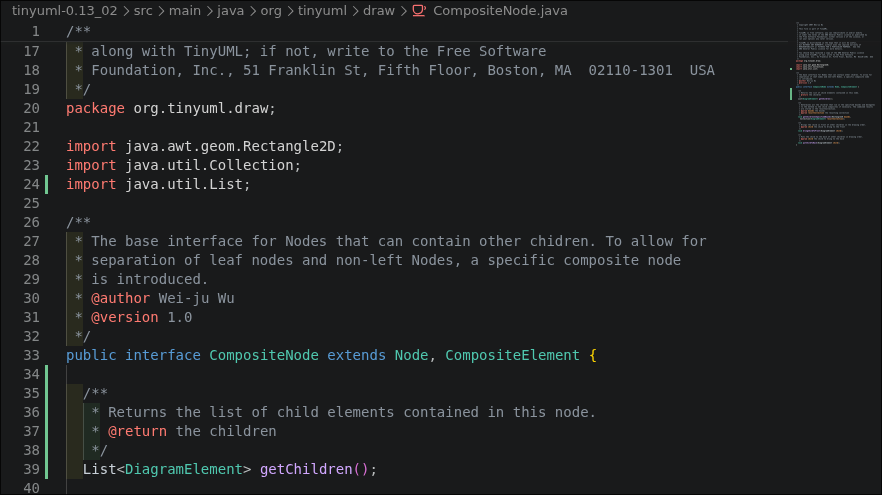

### 3. pom.xml

Al compilar tambien salian errores de tipo "unmappable character for encoding UTF8" en varios archivos del proyecto original. Esto pasa porque los .java del proyecto son del 2007 y estan guardados en Latin-1 (tienen acentos en los comentarios), pero el Maven moderno asume UTF-8 por defecto.

En vez de andar convirtiendo archivo por archivo, se agrego un bloque de properties en el pom.xml para decirle a Maven que los fuentes estan en ISO-8859-1. Asi no toque ningun .java por este motivo.

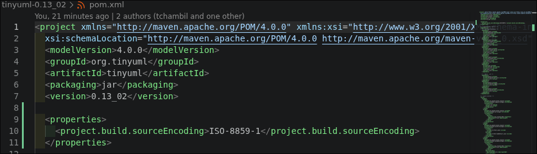

## Como correr el proyecto

Estoy en NixOS, asi que primero entro a un shell con JDK y Maven:

```bash
nix-shell -p jdk8 maven
```

Compilo:

```bash
mvn package
```

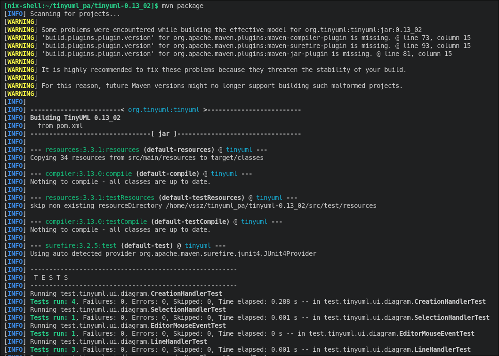
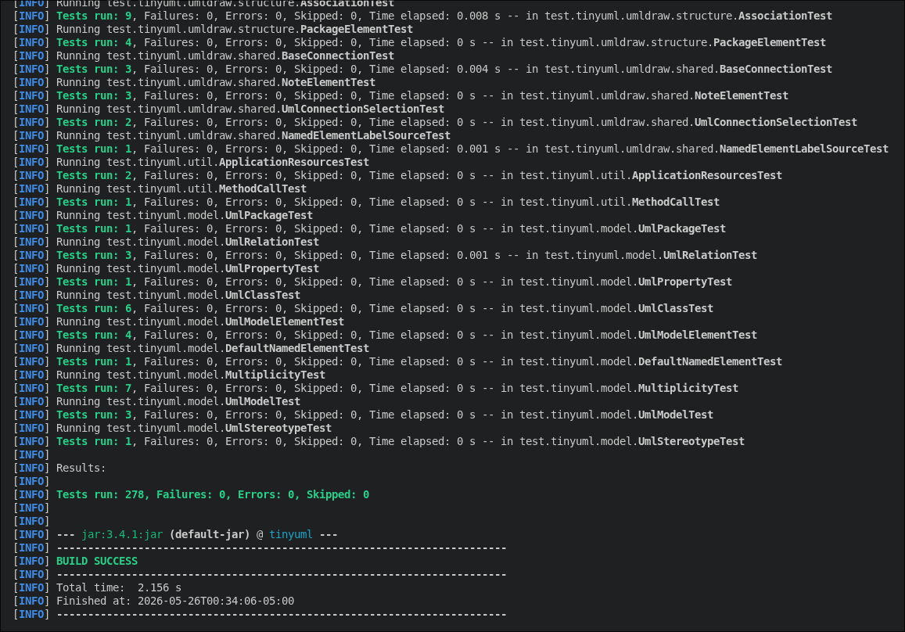

Lanzo el programa:

```bash
mvn exec:java -Dexec.mainClass=org.tinyuml.Main
```

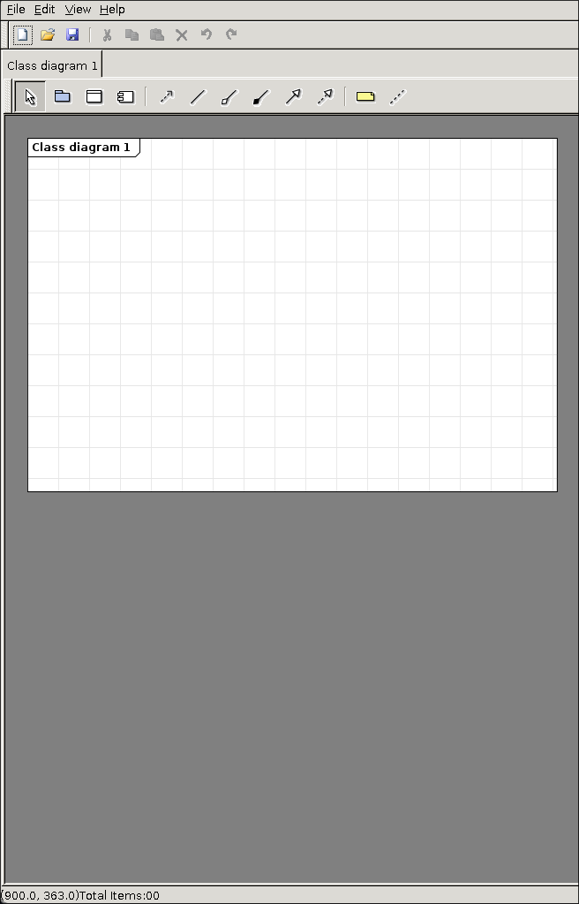

Y al agregar elementos al diagrama, la barra inferior se actualiza con el conteo por categoria:

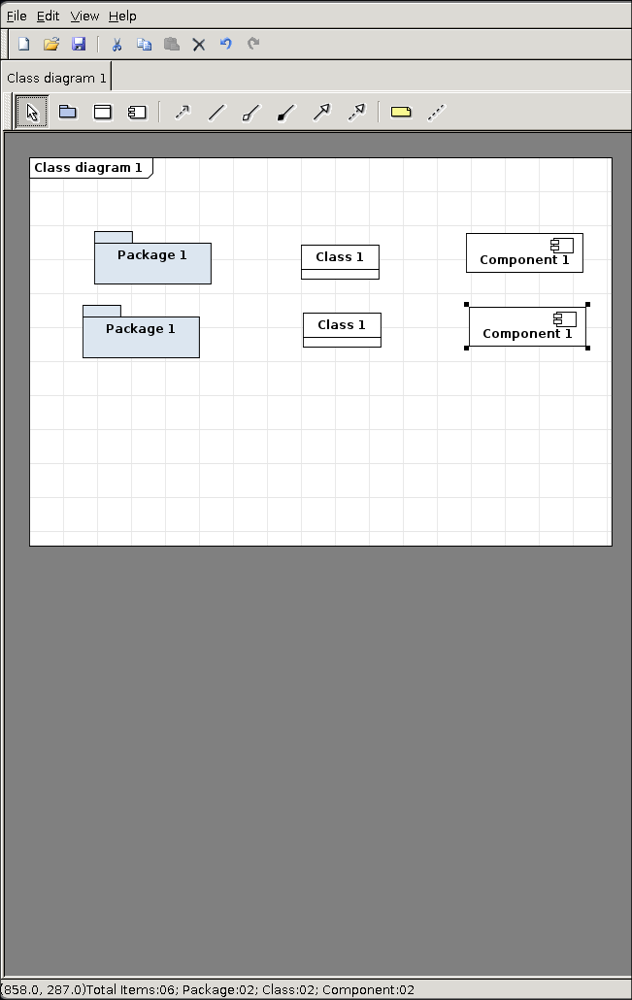
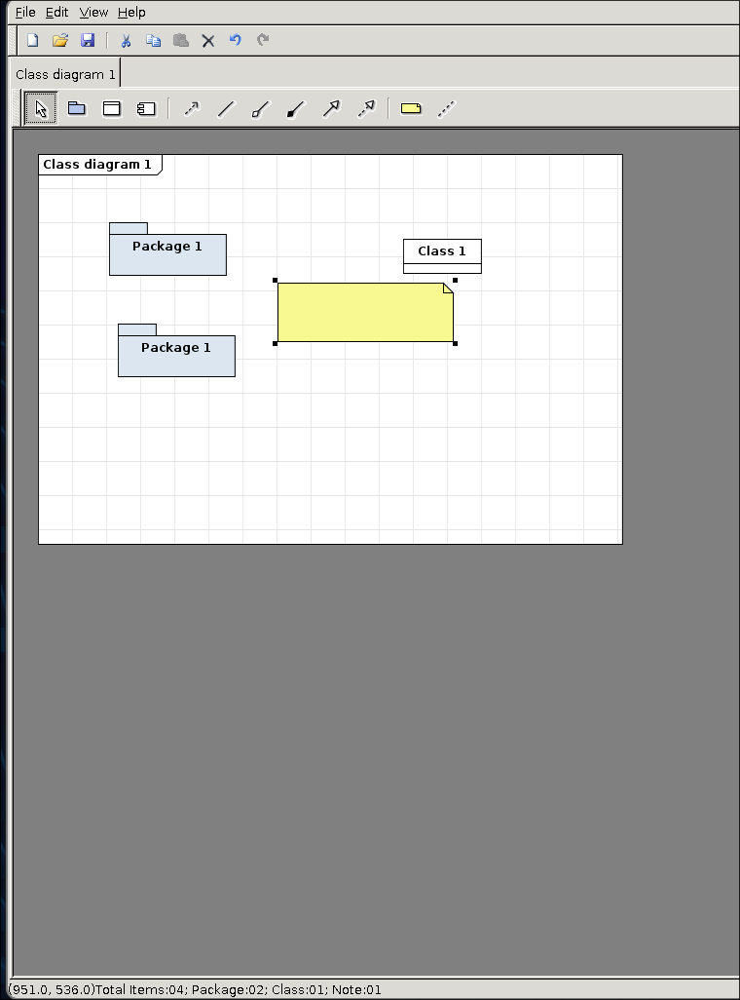
